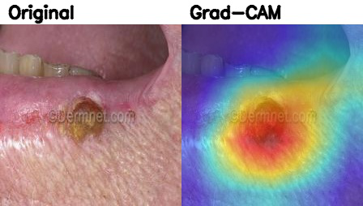
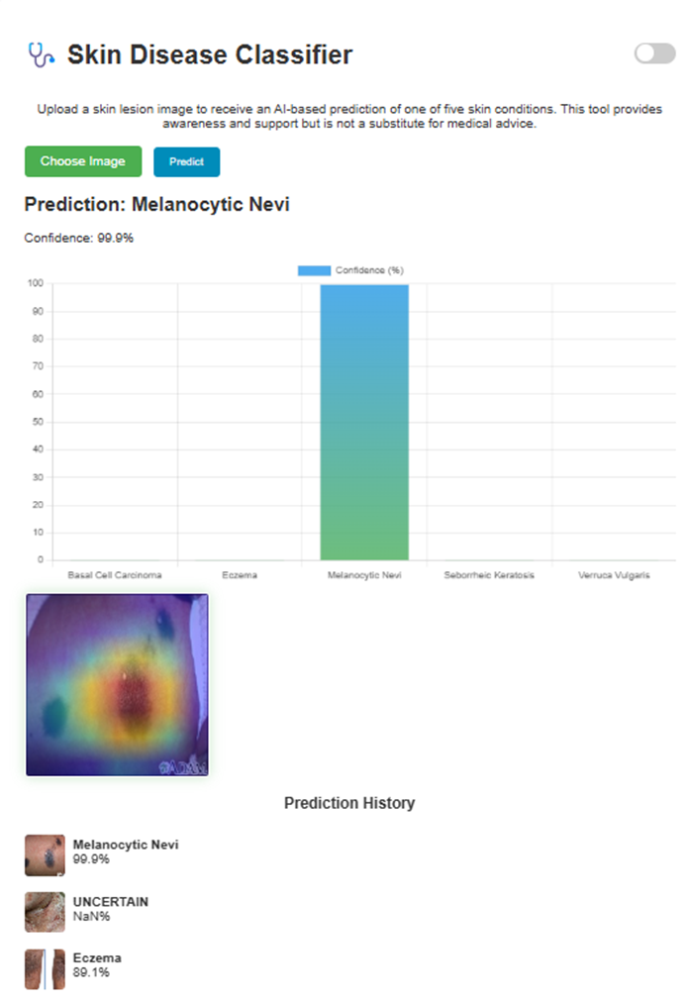

# Skin Disease Diagnosis using an Ensemble of Deep Learning Models

## About This Project
This project presents a **robust and equitable system** for the diagnosis of various skin diseases from dermatoscopic images. It leverages an **ensemble of multiple deep learning models** to achieve higher accuracy and more reliable predictions than a single model could.  

The system can classify skin lesions into several categories, such as **Basal Cell Carcinoma**, **Eczema**, and **Melanocytic Nevi**, with a strong focus on **fair performance across diverse skin tones**.

To provide insight into the models' decision-making processes, this project integrates **Grad-CAM (Gradient-weighted Class Activation Mapping)**, generating visual heatmaps that highlight the most important image regions for each prediction.

The project also includes a **user-friendly Flask web application**, allowing users to upload a skin lesion image and receive a diagnosis from the trained ensemble model in real-time.

---

## Example: Model Interpretability with Grad-CAM
Below is an example Grad-CAM visualization highlighting important regions for a skin lesion prediction:



---

## Addressing Algorithmic Bias in Dermatology
A significant challenge in medical AI is **algorithmic bias**, where models trained on unrepresentative data perform poorly on minority populations. In dermatology, datasets are often heavily skewed toward lighter skin tones, leading to AI systems that are less accurate for individuals with darker skin — exacerbating existing health disparities.

This project directly confronts this issue by:

- **Creating a Composite Dataset:** Merged three public datasets (**PAD-UFES-20**, **Stanford AIMI**, and **DermNet**) to build a more diverse and representative collection of images across various skin tones.
- **Using Data Augmentation:** Applied techniques such as contrast and brightness adjustments to simulate different lighting conditions and improve model generalization across all skin types.

**Goal:** Create a fair and equitable diagnostic tool that is reliable for all populations.

---

## Key Features
- **Multi-Model Ensemble:** Combines predictions from **DenseNet-121**, **EfficientNet**, and **MobileNetV3** for enhanced classification performance.
- **Fairness and Equity:** Specifically designed and trained on a diverse dataset to reduce skin tone bias.
- **Model Interpretability:** Uses **Grad-CAM** to generate heatmaps for transparent decision-making.
- **Confidence-Based Rejection:** Flags low-confidence predictions as *"Uncertain"*, advising referral to a specialist.
- **Web Application:** Intuitive interface for easy diagnosis via image upload.

---

## Models Used
The ensemble is composed of the following pre-trained and fine-tuned models:
- **DenseNet-121**
- **EfficientNet**
- **MobileNetV3**

---

## Project Structure
```
skin-lesion-project/
│
├── app/              # Flask web application
├── data/             # Raw and processed datasets (ignored by Git)
├── models/           # Trained model weights (.pth files, ignored by Git)
├── reports/          # Final figures, confusion matrices, results
├── src/              # Core Python source code
│   ├── data_preprocessing.py
│   ├── training.py
│   ├── evaluation.py
│   └── visualization.py
│
├── images/           # Images for README (Grad-CAM example, UI screenshot)
├── .gitignore        # Git ignore rules
├── README.md         # Project documentation
└── requirements.txt  # Python dependencies
```

---

## Setup and Installation

### **Prerequisites**
- Python **3.8+**
- `pip` (Python package installer)

---

### **1. Clone the Repository**
```bash
git clone https://github.com/your-username/skin-lesion-project.git
cd skin-lesion-project
```

### **2. Install Dependencies**
It’s recommended to use a virtual environment.

```bash
# Create & activate virtual environment
python -m venv venv
source venv/bin/activate    # On Windows: venv\Scripts\activate

# Install required packages
pip install -r requirements.txt
```

### **3. Download Data and Models**
Due to their large size, datasets and trained models are **not** stored in GitHub.

- **Dataset:** [<< INSERT YOUR DATASET DOWNLOAD LINK HERE >>]  
  Unzip and place the `processed_dataset` folder inside the `data/` directory.

- **Models:** [<< INSERT YOUR MODELS DOWNLOAD LINK HERE >>]  
  Place `.pth` model files inside the `models/` directory.

---

## How to Use the Project

### **Training a New Model**
Run from the `src/` directory:
```bash
python src/training.py --model densenet
```

### **Evaluating a Model**
```bash
python src/evaluation.py --model efficientnet
```

### **Launching the Web Application**
```bash
python app/app.py
```
Open your browser and go to:  
[http://127.0.0.1:5000](http://127.0.0.1:5000)

---

## Web Application Preview
Here’s a screenshot of the web interface for uploading and diagnosing skin lesion images:



---

## Contributing
Contributions are welcome! To contribute:

1. **Fork** the Project  
2. **Create a Feature Branch**  
   ```bash
   git checkout -b feature/AmazingFeature
   ```
3. **Commit Changes**  
   ```bash
   git commit -m 'Add some AmazingFeature'
   ```
4. **Push to Branch**  
   ```bash
   git push origin feature/AmazingFeature
   ```
5. **Open a Pull Request**

---

---

## Acknowledgements
- Composite dataset from **PAD-UFES-20**, **Stanford AIMI**, and **DermNet**.
- Special thanks to the creators of **PyTorch**, **Flask**, and **Grad-CAM** libraries.
